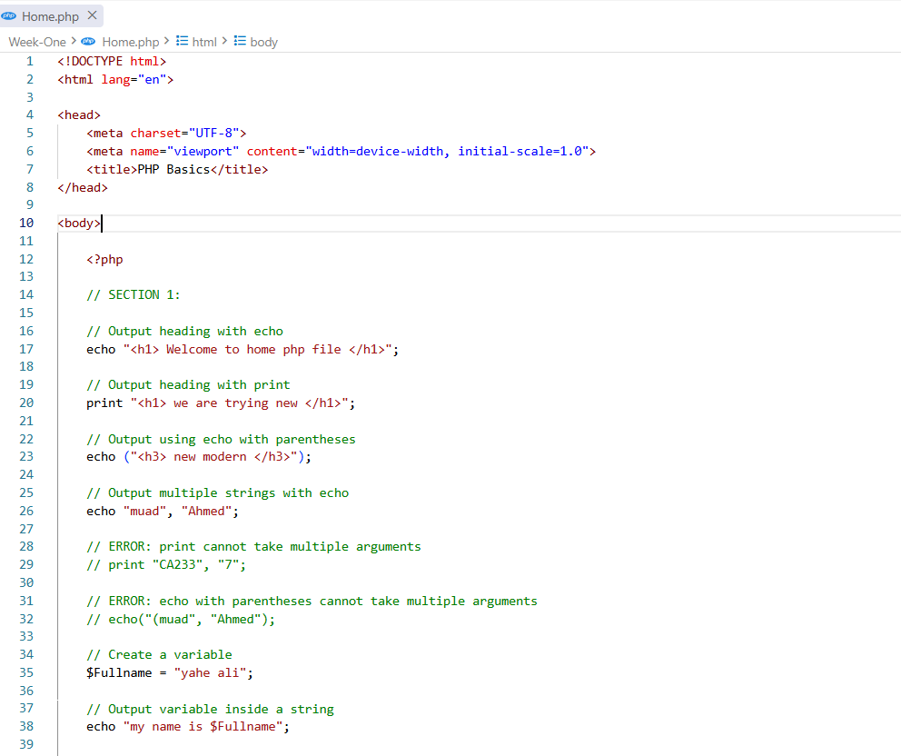
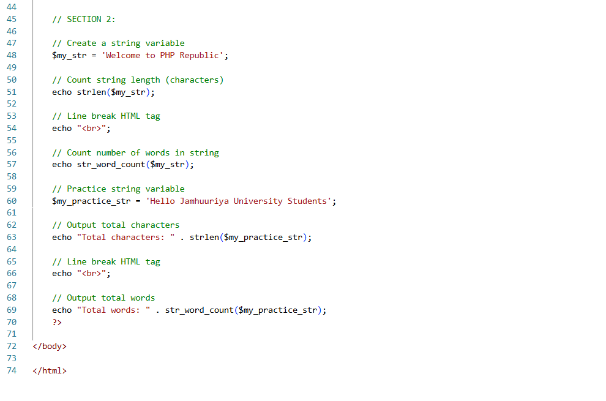

# Week 1: PHP Basics, Syntax Rules & Core Concepts

Welcome to the **Week 1** practical directory for the Web Application Development course. This module focuses on fundamental PHP concepts including output constructs, syntax constraints, quoting mechanics, documentation comments, variable behavior, data types, and core string functions.

---

## 📸 Practical Implementation & Visual Evidence

Below are the executed code outputs covering the entire scope of Week 1 core mechanics:

### 1. Output Statements, Variable Interpolation & Quotes
Demonstrates output generation using language constructs (`echo` vs `print`), parameter handling, variable evaluation within double quotes vs string literal treatment in single quotes.

---

### 2. Variable Scope, Comments & String Functions
Illustrates single/multi-line code documentation, dynamic type binding, variable naming rules, and string inspection using native helper functions.

---

## 🛠️ Comprehensive Technical Overview

### 1. Output Language Constructs (`echo` vs `print`)
* **`echo` Construct:**
  * Primary method for sending raw string or HTML output to the browser.
  * Faster execution as it returns no value.
  * Supports passing multiple comma-separated arguments (without parentheses).
* **`print` Construct:**
  * Returns an integer value of `1`, allowing it to be evaluated inside complex expression contexts (e.g., ternary operators).
  * Only accepts a single string argument.
* **Parentheses Rule:** Both `echo` and `print` are built-in language constructs, meaning parentheses are optional.

### 2. Quoting Mechanics & Variable Interpolation
* **Single Quotes (`' '`):** String literals. PHP parses content strictly as plain text without evaluating embedded variables or escape sequences.
* **Double Quotes (`" "`):** Interpolated strings. PHP actively parses the string to evaluate embedded variables (e.g., `$name`) and dynamic expressions.

### 3. Code Documentation (Comments)
* **Single-Line Comments:** Supported using double forward slashes (`//`) or the hash symbol (`#`).
* **Multi-Line Comments:** Block comments encapsulated between `/*` and `*/`.

### 4. Variables & Dynamic Typing
* **Declaration:** Variables must begin with a dollar sign (`$`), followed by a letter or underscore.
* **Case Sensitivity:** Variable names are strictly case-sensitive (`$Age` and `$age` are distinct), whereas PHP keywords, functions, and classes are case-insensitive.
* **Dynamic Binding:** PHP is loosely typed; variables adapt automatically to assigned data types without explicit type declaration.

### 5. Native Data Types & String Helpers
* **Scalar Types:** Supports `Integers`, `Floats` (Floating-point numbers), `Strings`, and `Booleans`.
* **`strlen($string)`:** Calculates total string length, including whitespace characters.
* **`str_word_count($string)`:** Counts the total number of words contained within a given string sequence.