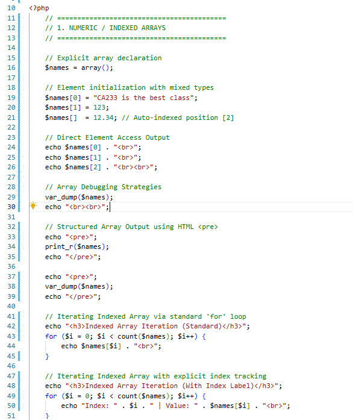
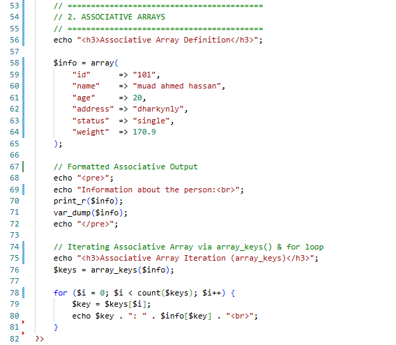

# Week 2: Control Flow, Logic, and PHP Data Structures (Arrays)

Welcome to the **Week 2** module documentation for Web Application Development. This repository contains complete technical implementations of runtime execution flows, logic control structures (`Index.php`), and PHP array data structure mechanics (`Lessont2.php`).

---

## 🎯 Module Learning Objectives

* **State Management & Logic Control:** Implement immutable constants (`define()`), multi-way conditional branching (`if/else`, `switch`), and short-circuit evaluation[cite: 34].
* **Loop Mechanics:** Benchmark entry-controlled (`while`, `for`) vs exit-controlled (`do-while`) iterative execution passes[cite: 30, 31, 32].
* **Array Data Structure Manipulation:** Initialize, access, and mutate dynamically-typed Indexed and Associative arrays[cite: 35, 36].
* **Array Debugging & Iteration:** Leverage PHP inspection utilities (`var_dump()`, `print_r()`) and inspect complex keys using procedural iteration (`array_keys()`)[cite: 35, 36].

---

## 📖 Key Definitions & Architectural Concepts

* **Indexed Array:** An ordered collection of elements where each item is identified by a continuous numerical zero-based index ($0, 1, 2 \dots$)[cite: 35].
* **Associative Array:** A map collection structure utilizing custom scalar key-value pairs (`key => value`) rather than positional dynamic integers[cite: 36].
* **`array_keys()` Strategy:** A functional operation extracting all keys from an associative array into a numerical vector to facilitate programmatic `for` loop traversal[cite: 36].
* **Formatted Printing (`<pre>`):** Enclosing array dump operations (`print_r`, `var_dump`) within HTML preformatted tags to preserve whitespace structure for inspectability[cite: 35, 36].

---

## 📸 Technical Implementation & Visual Evidence

### 1. Global Constants & Branching Conditionals (`Index.php`)

#### 📝 Technical Overview:
* **Immutable State:** Utilizes `define("age", 123)` to enforce global constant state across scripts[cite: 34].
* **Branching Logic:** Combines logical `if/else` checks with `switch` structures evaluating discrete expressions using explicit `break` termination[cite: 25, 27].

---

### 2. Ternary Operators & Execution Loop Mechanics (`Index.php`)

#### 📝 Technical Overview:
* **Short-circuit Evaluation:** Employs ternary logic `(condition) ? true : false` for compact expression execution[cite: 29].
* **Loop Traversal:** Contrasts entry-controlled `while` execution loops against guaranteed exit-controlled `do-while` loops[cite: 30, 31].

---

### 3. Iterative Matrix Processing (`Index.php`)

#### 📝 Technical Overview:
* **Bounded Sequences:** Executes bounded iteration via `for` constructs[cite: 32].
* **Matrix Evaluation:** Implements nested outer ($1 \to 5$) and inner ($1 \to 5$) loops to build dynamic product grids[cite: 33].

---

### 4. Numeric Indexed Arrays & Array Traversal (`Lessont2.php`)

#### 📝 Technical Overview:
* **Loose Typing Initialization:** Demonstrates array allocation handling dynamic typing (Strings, Integers, and Floats within single structures)[cite: 35].
* **Debugging Utilities:** Compares raw text dumps (`var_dump()`) against formatted array prints using `<pre>` wrapper tags[cite: 35].
* **Index Traversal:** Maps elements via dynamic `count($names)` bounds checking inside standard `for` loop constructs[cite: 35].

---

### 5. Associative Arrays & Key Iteration Architecture (`Lessont2.php`)

#### 📝 Technical Overview:
* **Key-Value Mapping:** Constructs associative collections mapping user attributes (`id`, `name`, `age`, `address`)[cite: 36].
* **Programmatic Key Extraction:** Leverages `array_keys($info)` to isolate dictionary keys, enabling procedural traversal across non-numeric key-value structures[cite: 36].