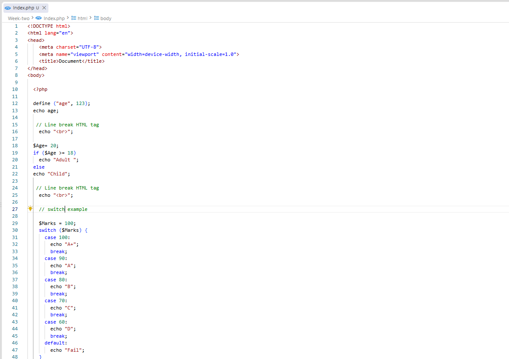
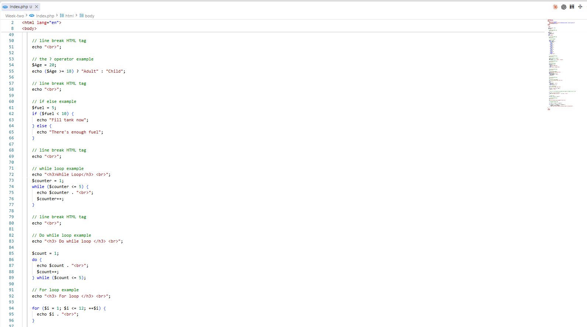
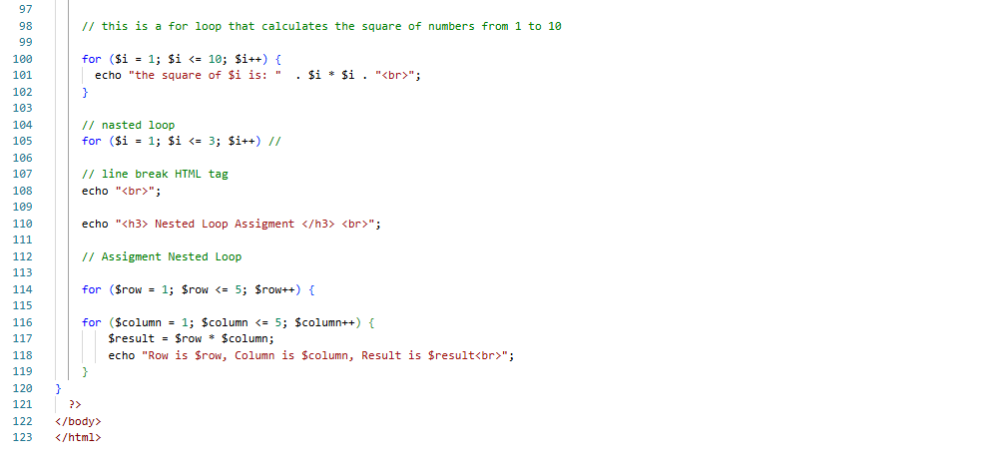

# Week 2 (Part 1): Control Structures, Logic & Iteration Architecture

Welcome to the **Week 2 (Part 1)** technical documentation for the Web Application Development module. This repository details the runtime execution mechanics, scope constructs, conditional branch evaluation, and iteration protocols implemented in `Index.php`.

---

## 🎯 Learning Objectives

By the end of this practical module, the core architectural goals achieved include:
* **Immutable State Management:** Understanding language constants (`define()`) vs runtime dynamic variable assignment[cite: 25, 34].
* **Control Flow Determination:** Evaluating standard `if/else` branching, discrete matching via `switch` control blocks, and short-circuit ternary evaluation[cite: 25, 27, 28, 29, 30].
* **Loop Mechanics & Execution Safety:** Differentiating entry-controlled (`while`) vs exit-controlled (`do-while`) execution behavior[cite: 30, 31].
* **Algorithmic Iteration & Matrix Evaluation:** Implementing bounded sequence processing and multi-dimensional nested loops for matrix operations[cite: 25, 32, 33].

---

## 📖 Key Definitions & Concepts

* **Control Structure:** A programmatic block that analyzes variable states and dictates the direction of execution flow based on parameters[cite: 25].
* **Constant Scope:** A global language identifier whose bound value cannot be reassigned or unbound during script execution[cite: 34].
* **Entry-Controlled Loop:** A loop condition checked *before* the body statement executes; if false, code inside never runs[cite: 30, 31].
* **Exit-Controlled Loop:** A loop condition checked *after* the body statement executes; guarantees execution at least once[cite: 31].
* **Multi-Dimensional Iteration:** Nesting loop structures where each outer iteration triggers a full execution cycle of the inner loop[cite: 33].

---

## 📸 Technical Implementation & Visual Evidence

### 1. Global Constants & Multi-Branch Conditional Logic

#### 📝 Technical Overview & Code Breakdown:
* **`define("age", 123)`:** Initializes an immutable global constant[cite: 34]. Unlike standard variables (`$Age`), constants bypass variable interpolation rules and dollar sign syntax[cite: 34].
* **If / Else Conditionals (`$Age >= 18`):** Evaluates boolean conditions to dynamically direct runtime flow between discrete execution branches[cite: 25, 26].
* **Switch Evaluation Structure:** Tests continuous equality matches against discrete expressions (`$Marks = 100`)[cite: 27]. Includes `break` keywords to prevent automatic fall-through behavior across cases[cite: 27, 28].

---

### 2. Compact Ternary Expressions & Entry/Exit Loop Control

#### 📝 Technical Overview & Code Breakdown:
* **Ternary Operator (`? :`):** Short-hand conditional operator evaluating `(condition) ? true_expr : false_expr`[cite: 29, 30]. Optimizes memory and code lines for basic assignment checks[cite: 30].
* **`while` Loop Mechanics:** Evaluates `$counter <= 5` prior to block execution[cite: 30, 31]. Increments internal counters explicitly (`$counter++`) to prevent infinite looping conditions.
* **`do-while` Loop Structure:** Guarantees a minimum single execution pass before evaluating the termination criteria `$count <= 5`[cite: 31].

---

### 3. Numerical Sequence Calculations & Dynamic Matrix Processing

#### 📝 Technical Overview & Code Breakdown:
* **Sequence `for` Loops:** Bounded counter iterations (`for ($i = 1; $i <= 10; $i++)`) executing mathematical transformations[cite: 32]. Evaluates numerical square values (`$i * $i`) via standard string concatenation (`.`)[cite: 32, 34].
* **Nested Matrix Generation:** Combines outer row iteration ($1 \to 5$) with inner column iteration ($1 \to 5$)[cite: 33]. Computes dynamic grid values ($Row \times Column$) inside a $5 \times 5$ execution matrix[cite: 33].